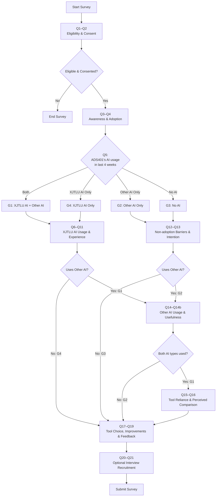

```mermaid
flowchart TD
    A["Start Survey"] --> B["Q1–Q2<br/>Eligibility & Consent"]
    
    B --> C{"Eligible & Consented?"}
    C -->|No| END["End Survey"]
    C -->|Yes| D["Q3–Q4<br/>Awareness & Adoption"]

    D --> E{"Q5: <br/>ADS401's AI usage<br/>in last 4 weeks "}

    E -->|"Both"| G1["G1: XJTLU AI + Other AI"]
    E -->|"Other AI Only"| G2["G2: Other AI Only"]
    E -->|"No AI"| G3["G3: No AI"]
    E -->|"XJTLU AI Only"| G4["G4: XJTLU AI Only"]

    G1 --> X["Q6–Q11<br/>XJTLU AI Usage & Experience"]
    G4 --> X

    G2 --> N["Q12–Q13<br/>Non-adoption Barriers & Intention"]
    G3 --> N

    X --> F{"Uses Other AI?"}
    F -->|Yes: G1| O["Q14–Q14b<br/>Other AI Usage & Usefulness"]
    F -->|No: G4| COM

    N --> H{"Uses Other AI?"}
    H -->|Yes: G2| O
    H -->|No: G3| COM

    O --> I{"Both AI types used?"}
    I -->|Yes: G1| J["Q15–Q16<br/>Tool Reliance & Perceived Comparison"]
    I -->|No: G2| COM
    J --> COM["Q17–Q19<br/>Tool Choice, Improvements & Feedback"]

    COM --> K["Q20–Q21<br/>Optional Interview Recruitment"]
    K --> L["Submit Survey"]
```